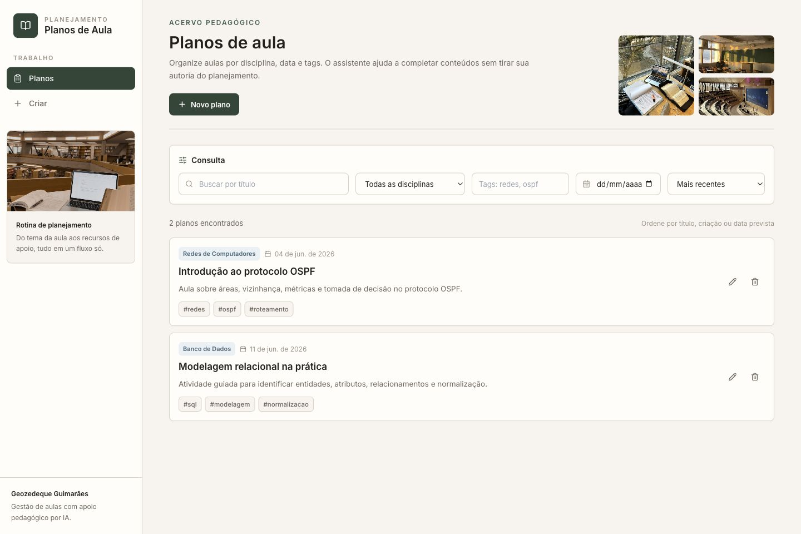
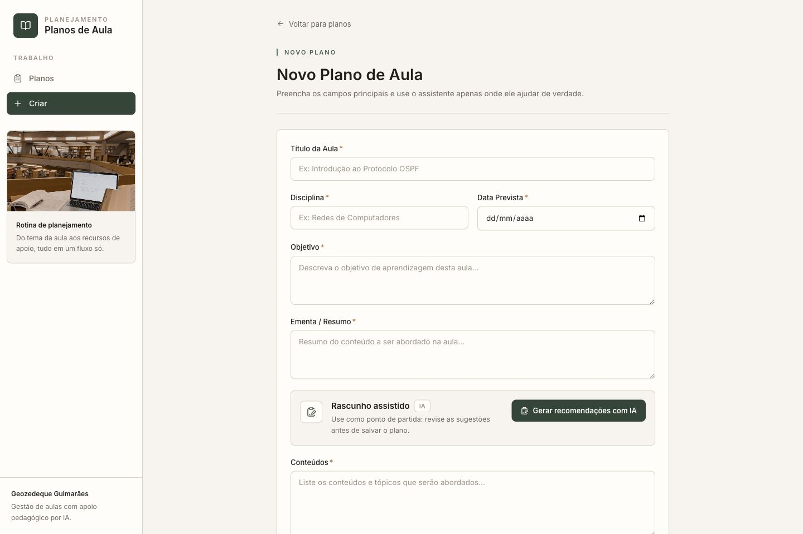

# Planos de Aula

Aplicação web para organizar planos de aula, consultar conteúdos por filtros e gerar sugestões pedagógicas a partir do tema da aula.

O projeto foi desenvolvido como uma solução completa para o desafio de manutenção de software: API REST, interface SPA, banco PostgreSQL, integração configurável com IA, Docker e pipeline de lint no GitHub Actions.

**Deploy:** [planos-de-aula-web.onrender.com](https://planos-de-aula-web.onrender.com)

O projeto usa um Blueprint do Render (`render.yaml`) que sobe frontend, backend e banco juntos.

## Interface





## O que a aplicação faz

- Cadastro, edição, remoção e listagem de planos de aula.
- Paginação, busca por título e filtros por disciplina, tags e data prevista.
- Ordenação por título, data de cadastro ou data prevista.
- Formulário validado com campos pedagógicos essenciais: objetivo, ementa, conteúdos, recursos e tags.
- Rascunho assistido com OpenAI ou Gemini para sugerir conteúdos, recursos de apoio e três tags.
- Health check em `/health`.
- Logs estruturados para operações principais e chamadas ao serviço de IA.
- Execução com Docker Compose em um único comando.

## Decisões de projeto

A interface foi pensada como uma ferramenta de trabalho para docentes e conteudistas. Em vez de uma tela promocional, a primeira experiência já entrega consulta, filtros e criação de planos.

O assistente não substitui a autoria do professor: ele aparece como apoio ao rascunho. A resposta da IA preenche campos editáveis, mantendo a revisão humana como parte natural do fluxo.

No backend, a API foi separada por camadas simples: rotas, controllers, services, validação e tratamento de erros. As chaves de IA são lidas por variável de ambiente e nunca devem ser versionadas.

## Stack

| Camada | Tecnologia |
| --- | --- |
| Frontend | React, Vite, Tailwind CSS, React Query |
| Backend | Node.js, Express, Joi |
| Banco | PostgreSQL, Prisma ORM |
| IA | OpenAI API ou Gemini API |
| Infra | Docker, Docker Compose, Nginx |
| CI | GitHub Actions com lint de frontend e backend |

## Como rodar com Docker

Pré-requisitos:

- Docker Desktop ou Docker Engine com Compose.
- Uma chave da OpenAI ou Gemini para usar o rascunho assistido.

Crie o arquivo de ambiente:

```bash
cp .env.example .env
```

Preencha o provedor de IA no `.env`. Exemplo com OpenAI:

```env
POSTGRES_USER=planos
POSTGRES_PASSWORD=planos
POSTGRES_DB=planos_de_aula
AI_PROVIDER=openai
OPENAI_API_KEY=sk-...
```

Exemplo com Gemini:

```env
POSTGRES_USER=planos
POSTGRES_PASSWORD=planos
POSTGRES_DB=planos_de_aula
AI_PROVIDER=gemini
GEMINI_API_KEY=sua-chave-do-google-ai-studio
GEMINI_MODEL=gemini-2.5-flash
```

Suba a aplicação:

```bash
docker compose up --build
```

Acesse:

| Serviço | URL |
| --- | --- |
| Frontend | `http://localhost` |
| Backend | `http://localhost:3001` |
| Health check | `http://localhost:3001/health` |

O backend sincroniza o schema do Prisma ao iniciar o container.

## Desenvolvimento local

Backend:

```bash
cd backend
cp .env.example .env
npm install
npx prisma generate
npm run dev
```

Frontend:

```bash
cd frontend
cp .env.example .env
npm install
npm run dev
```

Se o frontend estiver fora do Docker, configure:

```env
VITE_API_URL=http://localhost:3001/api
```

## Endpoints

| Método | Rota | Descrição |
| --- | --- | --- |
| `GET` | `/health` | Verifica o estado da API |
| `GET` | `/api/planos` | Lista planos com filtros e paginação |
| `POST` | `/api/planos` | Cria um plano |
| `GET` | `/api/planos/:id` | Busca um plano por ID |
| `PUT` | `/api/planos/:id` | Atualiza um plano |
| `DELETE` | `/api/planos/:id` | Remove um plano |
| `POST` | `/api/smart-assist` | Gera sugestões pedagógicas |

Parâmetros da listagem:

| Parâmetro | Descrição |
| --- | --- |
| `search` | Busca por título |
| `discipline` | Filtra por disciplina |
| `tags` | Filtra por tags separadas por vírgula |
| `scheduledAt` | Filtra a partir de uma data prevista |
| `orderBy` | `title`, `createdAt` ou `scheduledAt` |
| `order` | `asc` ou `desc` |
| `page` | Página atual |
| `limit` | Quantidade por página |

## Deploy Full-Stack

A forma mais simples de publicar a aplicação completa é pelo Render Blueprint. Ele cria três recursos a partir do `render.yaml`:

| Recurso | Função |
| --- | --- |
| `planos-de-aula-api` | Backend Docker com Express, Prisma e health check |
| `planos-de-aula-web` | Frontend React estático com fallback de SPA |
| `planos-de-aula-db` | PostgreSQL usado pela API |

No Render:

1. Crie um Blueprint apontando para este repositório.
2. Informe `GEMINI_API_KEY` nas variáveis do serviço `planos-de-aula-api`.
3. Confirme se `VITE_API_URL` no serviço `planos-de-aula-web` aponta para a URL pública da API criada pelo Render.
4. Faça o deploy. O backend executa `npx prisma db push && node src/app.js` ao iniciar.

O Blueprint usa Gemini por padrão:

```env
AI_PROVIDER=gemini
GEMINI_MODEL=gemini-2.5-flash
```

Se preferir OpenAI, altere `AI_PROVIDER=openai` no Render e preencha `OPENAI_API_KEY`.

## Deploy Manual

O projeto está pronto para deploy via Docker. Em um servidor ou serviço com suporte a containers, configure:

- `DATABASE_URL` apontando para um PostgreSQL.
- `AI_PROVIDER` com `openai` ou `gemini`.
- `OPENAI_API_KEY` ou `GEMINI_API_KEY`, conforme o provedor escolhido.
- `PORT=3001` no backend.
- `VITE_API_URL` no build do frontend, apontando para a URL pública da API.

Para buildar o frontend com uma API pública:

```bash
docker build \
  --build-arg VITE_API_URL=https://sua-api.com/api \
  -t planos-de-aula-frontend \
  ./frontend
```

Para o backend em produção, o comando usado no Compose é:

```bash
npx prisma db push && node src/app.js
```

## Observações sobre IA

O rascunho assistido depende de cota disponível no provedor configurado. O Gemini pode ser uma alternativa interessante para demonstrações por ter camada gratuita no Google AI Studio, mas ela também possui limites de uso. Se a chave estiver sem créditos, sem billing ativo ou com cota excedida, a aplicação informa o problema na própria tela.

Nunca publique `.env`, chaves de API ou tokens no repositório.

## Estrutura

```text
planos-de-aula/
├── backend/
│   ├── prisma/
│   └── src/
│       ├── config/
│       ├── controllers/
│       ├── middlewares/
│       ├── routes/
│       ├── services/
│       └── utils/
├── frontend/
│   ├── public/
│   └── src/
│       ├── components/
│       ├── pages/
│       └── services/
├── docs/
│   └── screenshots/
├── docker-compose.yml
└── .github/workflows/ci.yml
```

## Autor

Geozedeque Guimarães  
Estudante de Ciência da Computação, CIn-UFPE

[GitHub](https://github.com/GeozedequeGuimaraes) · [LinkedIn](https://linkedin.com/in/geozedeque-guimaraes)
